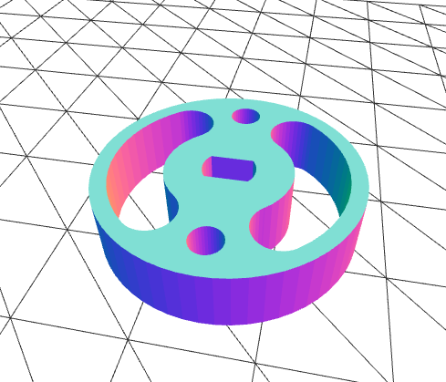

# Lab 8
## Information
Olivier Rogers: A16069362  
Moises Lopez: A14156109
## Introduction


## Challenge: The Final Boss

### Programming
The following modules work on their own thread. So that ther internal variables are always up to date. Communication between modules is done using queues.

### Detector.py
This module does the following.
- Gets image from the camera.
- Converts RGB to HSV color space
- Selects HSV range based on values sent from SQLManager.
- Does some more processing to select the biggest object of the given HSV range in the image.
- Finds the horizontal offset to be sent to the MotorController

### MotorController.py
- The motor controller uses the values sent from the detector to actuate the stepper motor.  
- If no centroid is sent, that means the camera cannot see any object. So the motorcontroller sets the state to "searching for an object." It does this by panning around until an object is found.

### GPS.py
This module does the following.
- Retrives the GPGGA coordinates from the device
- Converts the GPGGA coordinates to latitude and longtitude in degrees
- Then the degress are passed to a reversed geocoding library  
- The program will store the values listed above to be retrieved later by the webserver.

### SQLManager.py
- The purpose of this module is to control the comunication to the SQL database. This module stores the lower_hsv and upper_hsv values that the detector needs.  

For example. When the page is first loaded, the server uses this module to return a list of objects available in the database.
```
sql = SQLManager()
objects = sql.objects
```

When an object from the list is selected, the manager query the HSV values needed for the detector to track that object.
```
sql.set(object)
```

### WebServer.py
- The webserver, besides serving out the user interface, creates an instance of the afore mentioned modules, and handles communication between the modules and the client based on input from the client browser and the state of the modules.

### User Interface
- The select menu is populated on page load based on data the SQLManager returns to the web server.
- Images are updated periodically when searching for an object.
- When an object is found, the location is displayed and an option to save the object appears.
- The functions providing the dynamic behavior for the interface are defined in `rest.js`.

### Demonstration
The system in action along with the user interface can be seen in this [video](https://youtu.be/I85MJMIBmd4).  
<br>
### Problem
We experienced reliability issues with the RPI webcam. When it is initially plugged into the RPI, it will display images as expected if it is initialized right away. If we stop it and reinitialize it, It sends a distorted (wireframe/threshold) image. Because of this we used a different webcam that uses the same USB interface that the RPI cam uses, but did not suffer from the same reliability issues.  

|  |  |


*Example of distorted image. These images were taken consecutively by running the below script twice.*  


```python
import cv2

cam = cv2.VideoCapture(0) # Initialize the camera module
while(True):
  ret, image = cam.read() # Get the values (pixels) read by the camera
  cv2.imshow('original image',image)
  if cv2.waitKey(1) & 0xFF == ord('q'): 
    cv2.imwrite("image.png", image)
    break
cam.release() # Very Imp: Releasing the camera object
print('cam released')
```

## Tutorials

### Tutorial 1: Introduction to CAD

In this tutorial we used Solidworks to make the specified part used to mount the camera to the stepper motor.  
The part was exported to STL, and printed at the ECE Makerspace.


*The camera mount*

### Tutorial 2: Welcome to GPS
In this tutorial we learned how to connect a gps module to the Raspberry. And use Python to print the '$GPGGA' string from the device.


### Tutorial 3: Color Segmentation

This tutorial showed how to track an object by color. This was done by creating a mask that selects color values within a certain range, denoising, connecting adjacent masked values into objects, and selecting the largest object. Using the HSV color space allows good color tracking with good tolerance for poor lighting.    

  
*Live feed of selected mask next to input image.*
### Tutorial 4: Steper Motor
This tutorial showed the steper motor's internal workings. The device uses a rotor that creates magnetic fields by energising an eletromagnet. Then there is a responsive motor that has permanent magnet that align to the electromagnet's magnetic fields. We learned that the motor can do 360/(64*64) degree turn. And lastly learned how to control the device using python scripts.

### Tutorial 5: PID Controller
In this tutorial we learn how a PID feedback loop works. And how to implement PID in python.